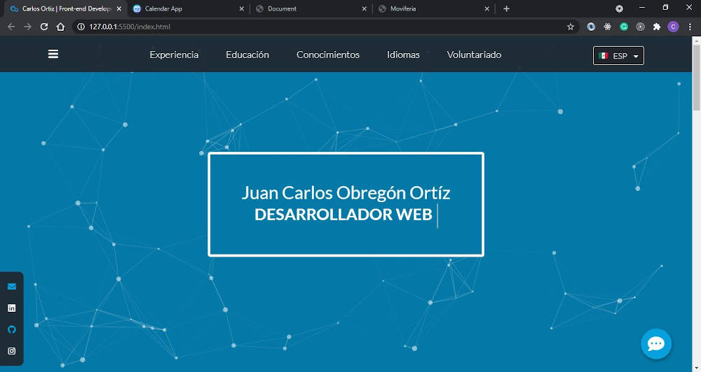

# My Resume Website

My resume, created with HTML, CSS, and JavaScript, includes features like a language switcher, a contact option, or displaying information as a chart, besides the basic static website functionalities.

<h2 align='center'><a href='https://carlosortiz.dev/'>Check it live here</a></h2>

## About the project

### JavaScript
* Language Switcher: Is implemented with vanilla JavaScript in the languages.js file
* app.js from the js folder, has most of the interactions built in the app. It contains ComponentsInfo and UI classes, and general, mobile, and desktop events:
    * ComponentsInfo: a class with all the strings used to create most of the components.
    * UI: the class responsible for the functionalities related to the UI. It has methods to create components or to modify elements.
* ContactForm.js and render.js: Are two files separated from the rest in the components folder. ContactForm is an experimental component that behaves as a react.js component, and render represents a function that updates the elements or attributes that rely on the state.

### Libraries
* [Particles.js](https://github.com/VincentGarreau/particles.js) - A lightweight JavaScript library for creating particles.

### API
As we didn't implement any backend server, we used [sheet.best](https://sheet.best/) to turn a spreadsheet file into a REST API to manage our contact form messages.

## Installation
Clone the repository and just open the index.html file in the browser

## Authors

- **Carlos Ortiz** - _Development_ - [CharlieOrtiz](https://github.com/CharlieOrtiz)
